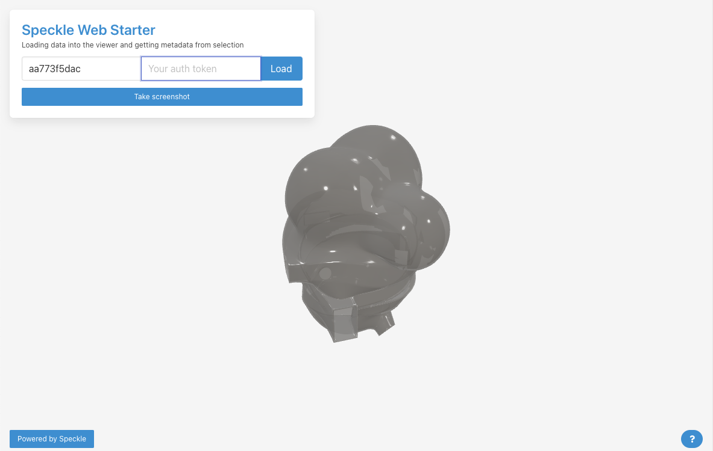
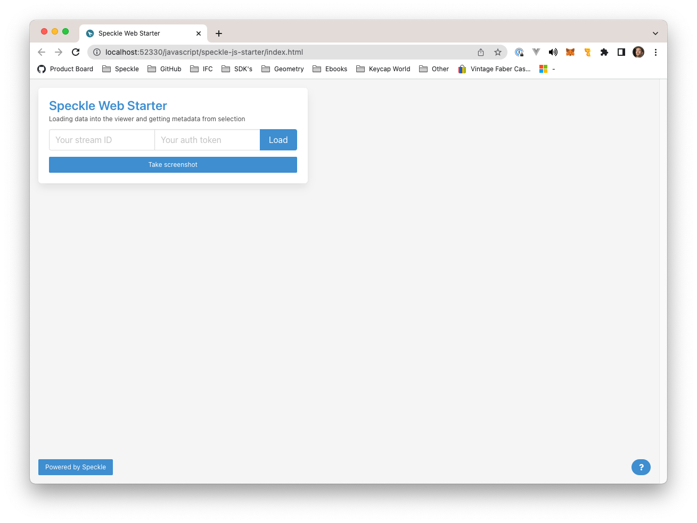
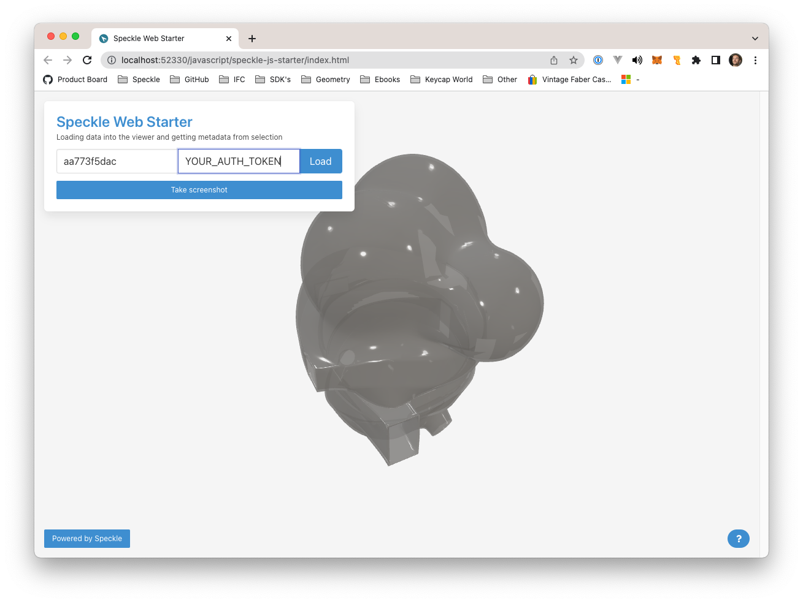
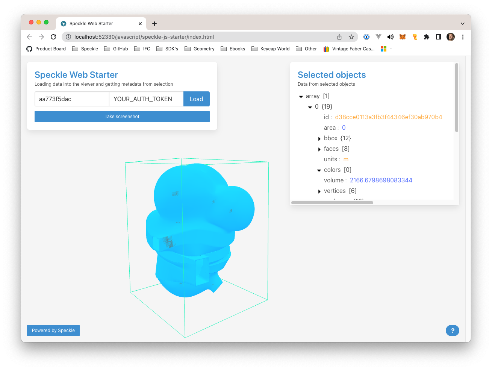

# Speckle HTML/JS Starter

   

## Introduction

> This is a basic `html/js/css` webpage that uses our `@speckle/viewer` package and some basic queries through our `graphQL` API.
> If you want to know more about Speckle as a developer platform, check our [Developer Docs](https://speckle.guide/dev)

The app is a basic demonstration of our Viewer and API, with basic functionality:

- Fetch stream information from Speckle using an auth token
- Visualize the latest commit of the `main` branch using the viewer
- Select objects on the 3D viewer to display their properties.

> If you're not sure how to create an `Auth Token` for your Speckle account, you can find all the information on the [Personal Access Tokens](https://speckle.guide/dev/tokens.html) of our dev docs.

## Usage

This demo should run directly in your browser. Just double click the `index.html` file on this folder.

> If you find problems loading the html file, you can try loading it using VSCode's Live Server extension.

Once the app loads you should see this 👇🏼

Fill in the ID of an existing stream you have access to. In the case the stream is private, you'll also need to provide an `Access Token`. Find out how to create it [here](https://speckle.guide/dev/tokens.html).

Press the **Load** button and the geometry should start loading in the 3D view:

Once loaded, click on any element to view it's properties:

## Repo structure

- `index.html`: Main html file
- `app.js`: Main `js` module for the website
- `speckleQueries.js` contains several `graphQL` queries for our API. We obtained these using [Speckle's API explorer](https://speckle.xyz/explorer)
- `speckleUtils.js` contains the functions to interact with the Speckle API.
- `styles.css`: Styles to used by `index.html`, using on Bulma.io

## Next steps

Once you've done with this example, you may also want to check some of the viewer's latest features on the [Speckle viewer API page](https://speckle.guide/dev/js.html#api)

## Documentation

Comprehensive developer and user documentation can be found in our:

#### 📚 [Speckle Docs website](https://speckle.guide/dev/)

## Contributing

Please make sure you read the [contribution guidelines](.github/CONTRIBUTING.md) for an overview of the best practices we try to follow.

## Community

The Speckle Community hangs out on [the forum](https://discourse.speckle.works), do join and introduce yourself & feel free to ask us questions!

## Security

For any security vulnerabilities or concerns, please contact us directly at security[at]speckle.systems.

## License

Unless otherwise described, the code in this repository is licensed under the Apache-2.0 License. Please note that some modules, extensions or code herein might be otherwise licensed. This is indicated either in the root of the containing folder under a different license file, or in the respective file's header. If you have any questions, don't hesitate to get in touch with us via [email](mailto:hello@speckle.systems).
