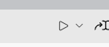

# Specklepy starter

[](https://twitter.com/SpeckleSystems) [](https://discourse.speckle.works) [](https://speckle.systems) [](https://speckle.guide/dev/)

## Introduction

This project is an example to showcase how to deal with local accounts, sending, receiving and creating new commits on a Speckle server using our Python SDK aka `specklepy`.

> If you're trying to run this you should have python installed on your machine, and the latest version of `specklepy`. You can install it via `pip install specklepy`.

### Running

If running from the terminal, just run:

```shell
python3 YOUR_DESIRED_PYTHON_EXAMPLE.py
```

If you're using VSCode for editing, you can just press the `Play` button that will appear on the top-right corner while you're python file is open:



The button also has a dropdown to choose to debug the current script, which is quite handy to set breakpoints and inspect variable values.

## Documentation

Comprehensive developer and user documentation can be found in our:

#### 📚 [Speckle Docs website](https://speckle.guide/dev/)

## Contributing

Please make sure you read the [contribution guidelines](.github/CONTRIBUTING.md) for an overview of the best practices we try to follow.

## Community

The Speckle Community hangs out on [the forum](https://discourse.speckle.works), do join and introduce yourself & feel free to ask us questions!

## Security

For any security vulnerabilities or concerns, please contact us directly at security[at]speckle.systems.

## License

Unless otherwise described, the code in this repository is licensed under the Apache-2.0 License. Please note that some modules, extensions or code herein might be otherwise licensed. This is indicated either in the root of the containing folder under a different license file, or in the respective file's header. If you have any questions, don't hesitate to get in touch with us via [email](mailto:hello@speckle.systems).
